```{r setup, include=FALSE}
knitr::opts_chunk$set(collapse = TRUE)
```

<span style="font-size:10px;">这是对原文的翻译和解读，纠错和讨论请发邮件至 hongchl3@outlook.com。<br/>
原文链接: [https://www.ncbi.nlm.nih.gov/pmc/articles/PMC1363130/pdf/jphysiol01298-0128.pdf](https://www.ncbi.nlm.nih.gov/pmc/articles/PMC1363130/pdf/jphysiol01298-0128.pdf)</span>

---

```{r, echo = FALSE}
setwd("/Users/hongchaoli/R/hongchaoli.com/content/post/2022-12-02-hubel-wiesel-1959/pictures")
```

在中枢神经系统中，从视网膜到纹状皮层这一视觉通路允许我们在几个不同的解剖部位观察和比较单单元的反应（细胞外单单元记录）。通过比较不同部位的反应的差异，我们能够试图理解不同部位在视觉中所起的作用。

Kuffler于1953年揭示了视网膜神经节细胞具有同心圆样的receptive field（RF，感受野）；中心on、外周off，或相反。on和off域相互拮抗。覆盖整个RF的光束刺激远没有只覆盖on或off域的刺激更能引起反应。类似地，Hubel于1959年发现视觉皮层的神经元大多数都对覆盖整个RF的光束刺激没有反应，而局限照射的光束通常会引起强烈反应。移动光束通常比静止光束产生的反应更强烈；有时某个方向移动的光束比反方向移动的光束产生的反应更强烈。

D. H. Hubel和T. N. Wiesel于1959年在The Journal of Physiology发表了以下文章，对麻醉状态下的猫的纹状皮层进行了细胞外单单元记录，研究了猫纹状皮层神经元的RF。与神经节细胞类似，纹状皮层神经元的RF也有on（激活域）和off（抑制域）区域。与神经节细胞非常不同的是，激活域和抑制域的形状和排列分布不是同心圆样。本研究还试图将移动光束引起的反应特点与RF的排列分布特点联系起来。有些神经元能被双眼刺激激活，本研究还探究了这些神经元的双眼交互特点。

```{r, echo=FALSE, fig.cap=" ", out.width = '100%'}
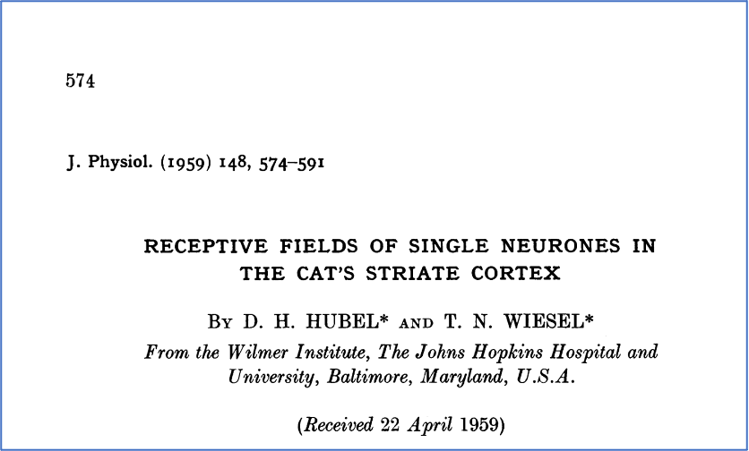
```

通过用静止光束作为刺激、移动光束作为刺激、刺激单眼或刺激双眼、改变光束的形状或大小或方向，本研究揭示了：

1. 在稳定的环境光照条件下且没有额外光刺激时，纹状皮层神经元存在自发电活动，加深麻醉可以减弱这种自发电活动。
2. 视网膜中，当受到光刺激时能够影响所记录的单元的电活动的有限区域被称为该单元的RF。通常RF能够被分为相互拮抗的激活域和抑制域。
3. 覆盖整个RF的光刺激或对整个视网膜的弥散的光刺激比较不能有效刺激大多数所记录的单元。这是由于激活域和抑制域之间的拮抗作用。
4. 用静止光束作为刺激的研究结果表明，激活域和抑制域以side-by-side的形式分布，中央区为激活域（图2）或抑制域（图1），两侧为拮抗的抑制域或激活域侧翼区（flanking areas）。侧翼区通常是不对称的，因为用静止刺激分别刺激两个侧翼区引起的电活动的变化程度不同。在某些单元中，只有一个激活域和一个抑制域（图4）。RF可以是水平的（图6）、垂直的（图1、2）或倾斜的（图7）。
5. 对一个单元的有效刺激有赖于一个特定形状、大小、位置和方向的光刺激，这个条件是由RF的激活域和抑制域的分布所决定的。
6. 用移动光束作为刺激的研究结果表明，向某些方向移动的光束比向其他方向移动的光束引起的反应更强烈。这种方向上的不对称优势可被RF分布的不对称所解释。
7. 本研究一共记录了45个单元，其中36个只能对单眼起反应：15个为同侧眼，21个为对侧眼。还有剩下9个能对双眼分别起反应：有些对双眼的反应相同，另一些存在优势眼。
8. 能对双眼起反应的单元中，双眼的RF的位置、大小、形状和方向大致是相同的，对移动光束的优势方向也是类似的。
9. 能对双眼起反应的单元中，双眼RF的激活域和抑制域能够向单个RF一样，存在交互作用：协同（图9，图10B）或拮抗（图10A）。

---

```{r, echo=FALSE, fig.cap="所记录的其中一个神经元对1度光束的反应。RF位于对侧眼，靠近area centralis并靠下、horizontal meridian鼻侧。a. 照射RF中央；b-e. 照射距离中央等距离的四个正方位；f. 用5度光束照射，覆盖整个RF。右侧示所记录的被激活（x）和被抑制（三角）的位置。", out.width = '75%'}
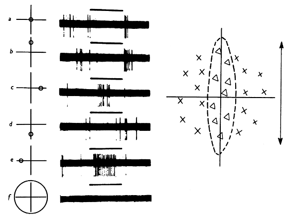
```

```{r, echo=FALSE, fig.cap="记录的另一个神经元对1度圆形光束照射的反应。RF位于对侧眼的area centralis（该神经元也能被同侧眼激活）。 a. 照射RF中央；b. 光束右移3度；c. 8度光束覆盖整个RF。", out.width = '75%'}
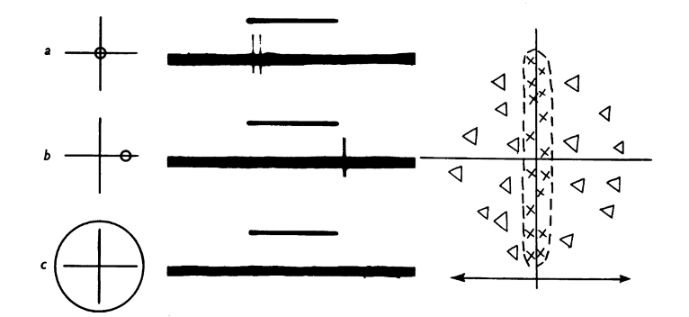
```

```{r, echo=FALSE, fig.cap="与fig.2同一神经元。A. 对1度x8度长方形光束的反应；光束中点与RF中点重合；光束顺时针旋转。B. 对不同方位的1度x5度光束的反应；光束的一端始终覆盖RF中央。", out.width = '75%'}
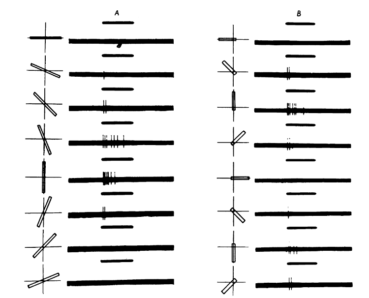
```

```{r, echo=FALSE, fig.cap="该神经元只对对侧眼有反应。RF位于area centralis的鼻侧边缘的外侧。a. 1度光线照射RF中央的抑制域；b. 照射RF右半边直径为12度的区域；c. 照射a+b区域。", out.width = '75%'}
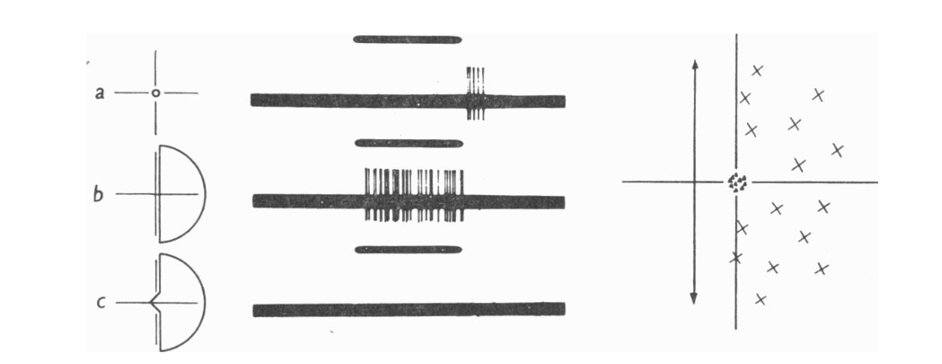
```

```{r, echo=FALSE, fig.cap="与fig.2、3相同的神经元。对直线方向上来回移动的1度x8度长方形光束的反应。a. 光束水平移动。b. 垂直移动。", out.width = '75%'}
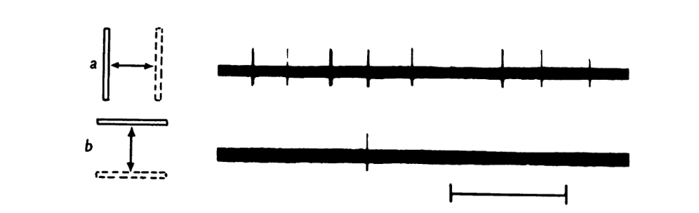
```

```{r, echo=FALSE, fig.cap="对缓慢上下移动的1度x8度水平长方形光束的反应", out.width = '75%'}
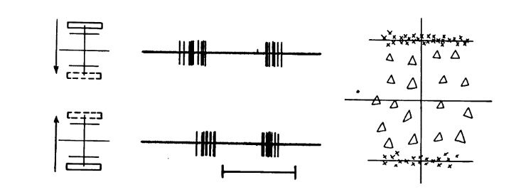
```

```{r, echo=FALSE, fig.cap="该神经元只被同侧眼激活。RF位于area centralis的颞侧，呈倾斜的长条形。左侧的激活域比右侧的激活域更能激活神经元。a. 1度x10度的光束覆盖中心区域；b. 覆盖左侧翼区；c. 12度圆形光束覆盖整个RF；d. 1度x10度光束平行于RF长轴、垂直于长轴移动。向左下移动比向右上移动更能激活神经元。", out.width = '75%'}
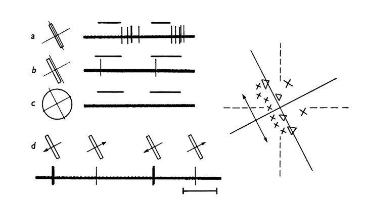
```

```{r, echo=FALSE, fig.cap="该神经元只被同侧眼激活，RF位于area centralis颞侧；对静止光束无反应，对移动光束有反应。0.5度x8度光束在不同方向上直线来回移动。只有向右上方移动时才有反应。", out.width = '50%'}
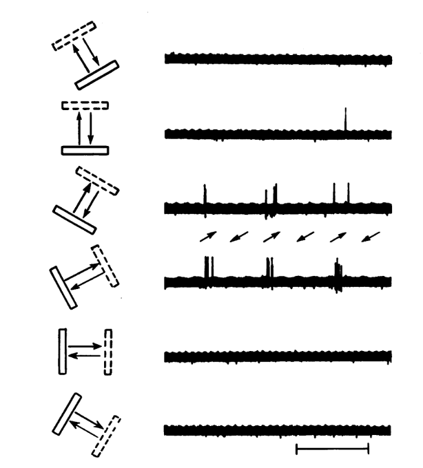
```

```{r, echo=FALSE, fig.cap="该神经元可被双眼分别激活。如右上图所示，两侧眼的RF的形状和方位相似。A. 1，水平长条光束覆盖右眼RF下部侧翼区；2，覆盖左眼下部侧翼区；3，两个相同光束同时覆盖双眼下部侧翼区。B. 1，一对水平长条光束覆盖右眼RF上、下部侧翼区；2，覆盖左眼；3，同时覆盖双眼。C. 1，覆盖右眼中心区；2，左眼；3，双眼。", out.width = '75%'}
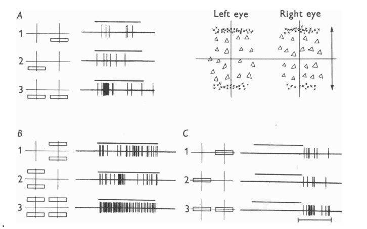
```

```{r, echo=FALSE, fig.cap="与fig.9相同的神经元。A. 左眼抑制域和右眼激活域之间的拮抗作用；所用刺激为静止光束。1，水平长方形光束覆盖左眼中心区；2，右眼上部侧翼区；3，同时覆盖左眼中心区和右眼上部侧翼区。B. 左眼抑制域和右眼激活域之间的协同作用；所用刺激为移动光束。1，遮住右眼，圆形光束移出左眼抑制域，产生“off”反应；2，遮住左眼，圆形光束移入右眼激活域，产生“on”反应；3，不遮盖，圆形光束从左眼抑制域移入右眼激活域，产生更强烈的“on”反应。", out.width = '75%'}
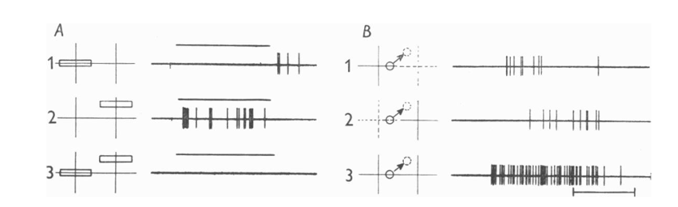
```

---

Kuffler（1953）已经揭示了视网膜神经节细胞的RF具有激活域和抑制域，Huber&Wiesel（unpublished）对外侧膝状体神经元的研究也发现了同样的结果。本研究发现纹状皮层神经元也不例外。所以，RF具有激活域和抑制域这一特点通用于视觉通路的三个解剖位置。

神经节细胞和外侧膝状体神经元对于覆盖整个RF的光刺激能产生反应，然而本研究所记录的纹状皮层神经元大都对覆盖整个RF的光刺激没有或只有很小的反应，说明激活域和抑制域的拮抗作用在皮层表现得更明显。

纹状皮层神经元与神经节细胞最大的不同在于RF的激活域和抑制域的具体分布。本研究所记录的所有纹状皮层神经元的RF都不是同心圆样分布。与RF的分布相对应，圆形的光束最能有效地刺激神经节细胞；而通常最能有效刺激纹状皮层神经元的光束都不是圆形的，且光束的方向很重要。RF的排列分布似乎与最有效的光刺激形式有关。本研究还发现，移动光束比静止光束更能有效地刺激纹状皮层神经元，且移动的方向很重要。如何解释移动光束更有效？图10的结果（静止光束表现为拮抗，移动光束表现为协同）似乎表明移动造成了激活域和抑制域之间的协同作用，从而产生更强烈的反应。

这种RF具有激活域和抑制域的现象也在听觉（Galambos，1944）和触压觉中存在（Mountcastle，1957）。也许这种现象与增强对比、提高感觉的分辨能力有关。本研究还提示了另外两个重要的功能：RF的激活域和抑制域的特定分布似乎决定了最有效刺激的形状、大小和方向；RF的特定分布也可能与对运动的感知有关。

从双眼交互的研究结果可以联想到，当双眼聚焦于某个物体时（双眼的RF完全重叠），该物体引起的反应最强烈，从而增加对该物体的感知；而没有被聚焦的周围物体则不会引起皮层的强烈反应，从而降低了对周围的感知。

本研究的局限性在于，所记录的神经元数量少。RF可能不局限于本研究所发现的形状和分布，因此本研究也无法对各种类型的RF分布进行分类。

---


